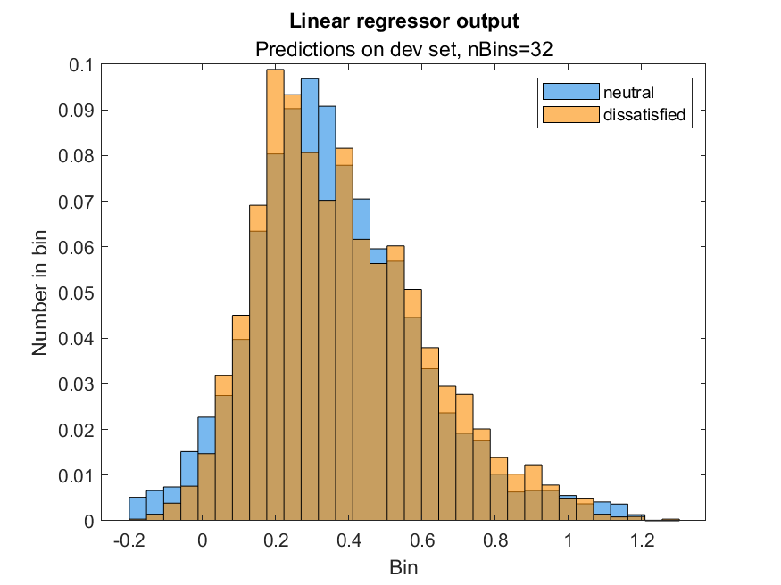

# Detecting dissatisfaction in spoken dialog

## Set up

1. Clone this repo or download it as a ZIP and extract.
1. Download The UTEP Corpus of Dissatisfaction in Spoken Dialog at
   <https://github.com/joneavila/utep-dissatisfaction-corpus>. Place the `calls`
   folder and `call-log.xlsx` in the root of this project.
1. Download Midlevel Prosodic Features Toolkit at
   <https://github.com/nigelgward/midlevel>. Place the `midlevel-master` folder
   in the root of this project.
1. Open this project
(`dissatisfaction-models` folder) in MATLAB and add the folder and its subfolders to
   Path. Right-click the folder in the Current Folder window or use the
   [addpath](https://www.mathworks.com/help/matlab/ref/addpath.html) function.

## Notes

**Results for 'ja' annotations only and predicting on dev set.**


We took the corpus and annotated customer utterances. See [annotations](annotations). To predict dissatisfaction
on a scale from 0 to 1 where 0 is neutral (negative class) and 1 is dissatisfied
(positive class), `n` and `nn` are read as 0, `d` and `dd` are read as 1, and
all other labels are ignored. See [annotations/annotation-guide.txt](annotations/annotation-guide.txt).

Features used are original mono.fss with added `cp` for same windows.

The code was written in MATLAB and uses MATLAB's built-in functions for
performing linear regression, logistic regression, and k-nearest neighbor
classification.

## Adding all `cp` features to spec file impacts performance, not in a good way. Why?
Compare the linear regression model's output when using `mono.fss` plus just a
couple of `cp` features around t=0 versus when using `mono.fss` plus all `cp`
features (windows) to match the rest of the features.

```NONE
min(yPred)=-0.254, max(yPred)=1.554
thresholdMin=-0.25, thresholdMax=1.55, thresholdStep=0.05
    threshold    precisionLinear    precisionBaseline
    _________    _______________    _________________

      -0.25          0.25693             0.25692     
       -0.2            0.257             0.25692     
      -0.15          0.25725             0.25692     
       -0.1          0.25801             0.25692     
      -0.05          0.25909             0.25692     
          0          0.26046             0.25692     
       0.05          0.26283             0.25692     
        0.1          0.26503             0.25692     
       0.15          0.26552             0.25692     
        0.2          0.26216             0.25692     
       0.25          0.25859             0.25692     
        0.3            0.259             0.25692     
       0.35          0.26555             0.25692     
        0.4          0.27456             0.25692     
       0.45          0.28116             0.25692     
        0.5          0.29068             0.25692     
       0.55          0.31103             0.25692     
        0.6          0.31953             0.25692     
       0.65          0.32839             0.25692     
        0.7          0.35629             0.25692     
       0.75           0.4002             0.25692     
        0.8          0.43476             0.25692     
       0.85          0.45255             0.25692     
        0.9          0.48034             0.25692     
       0.95          0.55299             0.25692     
          1          0.65865                 NaN     
       1.05          0.75896                 NaN     
        1.1          0.80048                 NaN     
       1.15          0.86245                 NaN     
        1.2                1                 NaN     
       1.25                1                 NaN     
        1.3                1                 NaN     
       1.35                1                 NaN     
        1.4                1                 NaN     
       1.45                1                 NaN     
        1.5                1                 NaN     

```

```NONE
min(yPred)=-0.299, max(yPred)=1.303
thresholdMin=-0.25, thresholdMax=1.55, thresholdStep=0.05
    threshold    precisionLinear    precisionBaseline
    _________    _______________    _________________

      -0.25            0.257             0.25692     
       -0.2          0.25746             0.25692     
      -0.15          0.25844             0.25692     
       -0.1          0.25941             0.25692     
      -0.05           0.2602             0.25692     
          0          0.26219             0.25692     
       0.05          0.26309             0.25692     
        0.1           0.2623             0.25692     
       0.15          0.26152             0.25692     
        0.2          0.25907             0.25692     
       0.25          0.25435             0.25692     
        0.3          0.25874             0.25692     
       0.35          0.26817             0.25692     
        0.4          0.27048             0.25692     
       0.45          0.27754             0.25692     
        0.5          0.28716             0.25692     
       0.55          0.29301             0.25692     
        0.6          0.29601             0.25692     
       0.65          0.29951             0.25692     
        0.7          0.29761             0.25692     
       0.75          0.29004             0.25692     
        0.8          0.29346             0.25692     
       0.85          0.27577             0.25692     
        0.9          0.25429             0.25692     
       0.95          0.21577             0.25692     
          1          0.19256                 NaN     
       1.05             0.15                 NaN     
        1.1          0.12903                 NaN     
       1.15          0.20896                 NaN     
        1.2          0.27273                 NaN     
       1.25             0.75                 NaN     
        1.3              0.5                 NaN     
       1.35                0                 NaN     
        1.4                0                 NaN     
       1.45                0                 NaN     
        1.5                0                 NaN   
```




## Frame-level models

The frame-level models share a train, dev, and test set (`frame-level/train.tl`,
`frame-level/dev.tl`, and `frame-level/train.tl`, respectively). Each set is 6
dialogs, half labeled as neutral and half labeled as dissatisfied on the
dialog-level. The dissatisfied dialogs still have many neutral utterances so the
data is not balanced.

set | `n` or `nn` frames | `d` and `dd` frames | total frames
---   | --- | --- | ---
train | NUM | NUM | NUM
dev   | NUM | NUM | NUM
test  | NUM | NUM | NUM

### Majority-class baseline

The baseline always predicts the majority class (neutral). Its MAE is **NUM**.

### Linear regression model

A linear regressor. The MAE is **NUM**. The learned coefficients are saved to
`coefficients.txt`.

```NONE
Coefficients in descending order with format:
coefficient, value, abbreviation
17 | 1.223681 | se cr -1600 -800
30 | 0.996185 | se cr  +800  +1600
29 | 0.517663 | se cr  +400  +800
18 | 0.506640 | se cr -800 -400
16 | 0.161338 | se vo  +1600  +3200
...
57 | -0.281625 | se th  +400  +800
31 | -0.381581 | se tl -1600 -800
45 | -0.449197 | se th -1600 -800
44 | -0.451788 | se tl  +800  +1600
58 | -0.935403 | se th  +800  +1600
```

Most of the top (first five largest magnitude) features are creakiness, possibly
because ... The bottom (last five) features are all 'th' and 'tl' relating to
... possibly because ...

The baseline always predicts 1 for perfectly dissatisfied. (Insert table print
out with precision values.)

To run from MATLAB: `>> linearRegression`

### k-NN model

A k-nearest neighbor classifier with number of neighbors 5 and rest of default
parameters. The F-score is **NUM** and MAE is **NUM**.

To run from MATLAB: `>> kNNframeLevel`

### Logistic regression model

MAE is **NUM**.

To run from MATLAB: `>> logisticRegression`

## Utterance-level model

Utterance-level. Predict utterances using linear regressor's frame-level
predictions. For each utterance in the dev set, predicts the mean of the
predictions on the frames in that utterance. The baseline always predicts the
majority class from the train set (neutral). The MAE is **NUM**. The baseline MAE
is **NUM**.

To run from MATLAB: `>> utteranceLevel`

## Dialog-level k-NN model

A k-nearest neighbor classifier. Number of neighbors is 5 and rest of default
parameters. X and y are downsampled so that each frame is 100ms apart. The MAE
is **NUM** and F1 score **NUM**. The baseline predicts the majority class (neutral);
its MAE is **NUM** and F1 score **NUM**.

To run from MATLAB: `>> kNNdialogLevel`

## Histograms

Save a histogram for each feature in the train and dev set. Save histograms
to `frame-level/images`. Here's an example (replace example),

The histograms are normalized so that bar heights add to 1. feat01 through
feat16 (volume) have bimodal distributions likely because quiet frames like
those at the start and end of utterances make up the first mode and the average
speaking volume makes up the second mode. A silent frame is more likely to be
neutral, possibly because neutral utterances tend to be shorter and the more
utterances the more silence is introduced at the start and end of those
utterances. feat17 through feat30 (creakiness) have skewed distributions likely
because there is little evidence for creakiness and so the distribution skews
right. feat69 through feat78 (wide pitch) distributions show that frames above a
threshold (around 0.8, depending on the window) are more likely to be
dissatisfied, and frames below the threshold are more likely to be neutral.
Shock might explain some wideness, for example someone saying "What? I thought
you said..."

The code also generates a histogram for the linear regressor's output on the dev
set (replace image). This shows that...

To run from MATLAB: `>> generateHistograms`

## t-tests

The first t-test is for features between neutral frames (N) and dissatisfied
frames (D) from the
train and dev set. Output (replace output),

The second t-test is between the linear regressor's predictions for N and
predictions D. The test result is **NUM** (rejects null hypothesis if value is 1).

To run from MATLAB: `>> tTests`
